<p align="center">
  
</p>

<h1 align="center">vidpolish</h1>

<p align="center">
  Turn a raw screen recording into a polished, clean, tightly cut video with one command.
</p>

---

## Install

```sh
curl -fsSL https://raw.githubusercontent.com/shrsv/vidpolish/main/scripts/install.sh | bash
```

This downloads the right prebuilt binary for your OS/arch from the
[latest release](https://github.com/shrsv/vidpolish/releases/latest),
installs it to `~/.local/bin`, wires up your `PATH`, and runs `vidpolish
deps` so ffmpeg is checked and the other tool dependencies (deep-filter,
auto-editor, resvg, font) are fetched right away. Supported platforms:
Linux (amd64/arm64) and macOS (amd64/arm64); Windows users can grab
`vidpolish-windows-amd64.exe` directly from the releases page.

Then either run it once:

```sh
vidpolish process <input.mp4>
```

or start the [local UI](#local-ui):

```sh
vidpolish ui
```

Building from source (`make build`, or `go install`) still works as before
if you'd rather not use the installer.

## What it does

vidpolish takes a raw talking-head or screen recording and runs it through a
small pipeline:

1. **Split** the input into a video-only stream and an audio-only track.
2. **Denoise** the audio with [DeepFilterNet](https://github.com/Rikorose/DeepFilterNet)
   (the `deep-filter` CLI), the same kind of deep-learning noise removal
   behind tools like Adobe Podcast.
3. **Remux** the cleaned audio back onto the video.
4. **Auto-cut** silence and dead air with [auto-editor](https://github.com/WyattBlue/auto-editor),
   optionally speeding up the parts you kept.
5. **Resize/re-encode** (optional) — only runs at all if you actually ask
   for a different resolution or bitrate; left alone, the auto-cut output
   is used as-is.

Every stage shells out to a well-tested external binary instead of
reinventing audio/video processing in Go: vidpolish is just the orchestrator
gluing them together with sensible defaults, caching, and a simple CLI.

## Why

Recording a quick Loom-style walkthrough is easy. Cleaning it up by hand,
trimming pauses, cutting background hiss, isn't. vidpolish automates that
part so a five-minute rough recording turns into a tight, clean clip in one
command, without you touching a timeline editor.

## Screenshots

A quick tour of the local UI (`vidpolish ui`) — the same "Projects"
notebook model described in [Local UI](#local-ui) below. (The video
preview in these shots is a generated color-bars/tone clip, not a real
recording — same idea as an SMPTE test card, used here purely so the
screenshots don't include anyone's actual footage.)

<table>
<tr><td width="33%">

**Projects list** — every project you've started, one click to open.

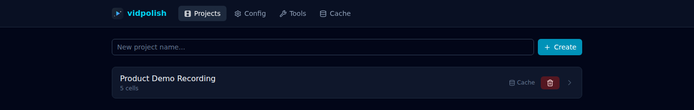

</td><td width="33%">

**Category quick-nav + collapse-all** — jump between Source/Edit/Upload
sections, or collapse every cell down to its header row.

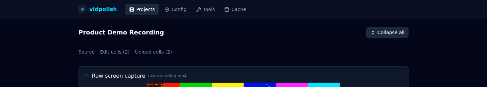

</td><td width="34%">

**Cache panel** — shows which project a cache entry belongs to, and makes
clear that deleting an entry never deletes the project itself.

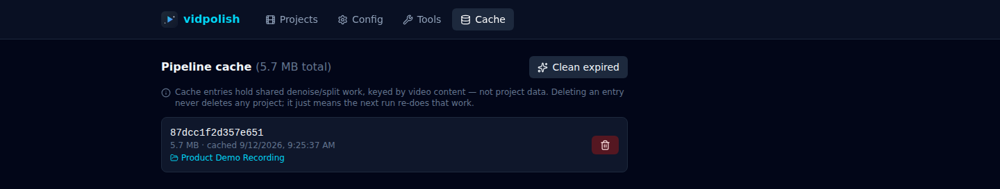

</td></tr>
</table>

**A project's notebook view** — source cell and edit cells in one
scrollable page, with drag-to-reorder (from the grip handle) within each
section.

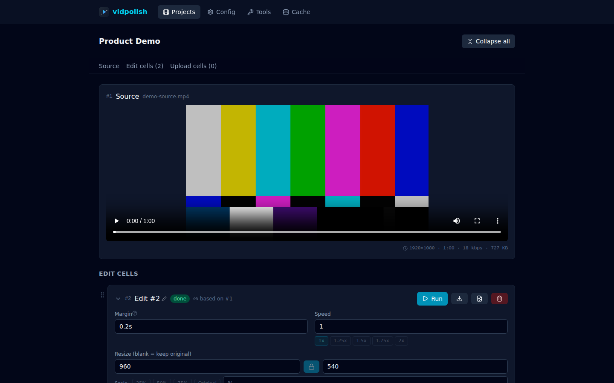

**Collapsed cells** — a compact overview of a project once you don't need
every cell expanded.

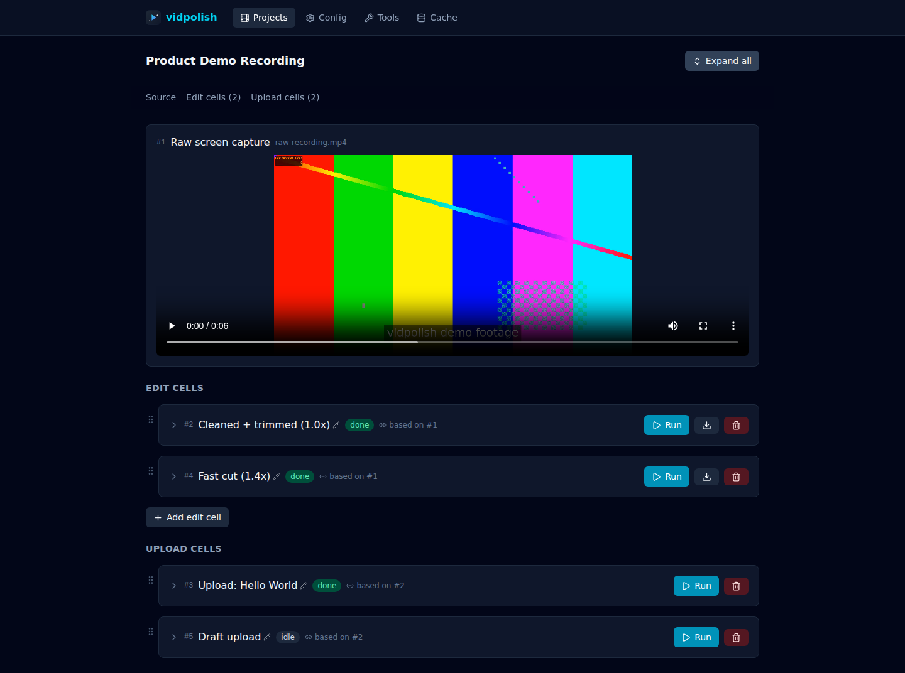

<table>
<tr><td width="50%">

**An edit cell at rest** — margin (with an inline explanation), speed
presets, resize (exact pixels or a quick 25/50/75%/original scale, with an
aspect-ratio lock), bitrate, and a live pre-run size estimate.

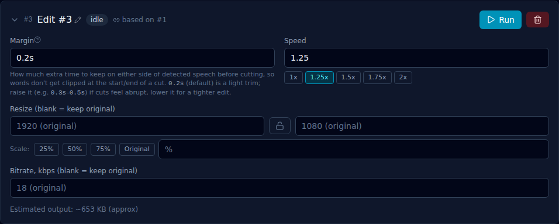

</td><td width="50%">

**Tool status** — the same checks as `vidpolish deps`, with a re-check
button per tool.

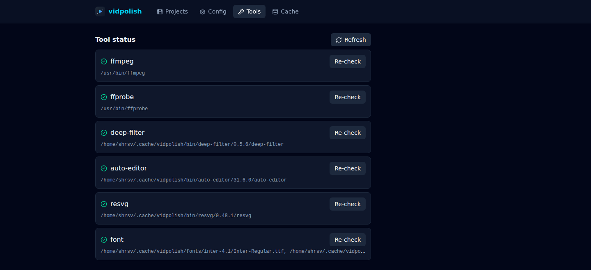

</td></tr>
<tr><td width="50%">

**Live thumbnail preview** — the auto-generated YouTube thumbnail updates
as you type the title, before you've even run the upload.

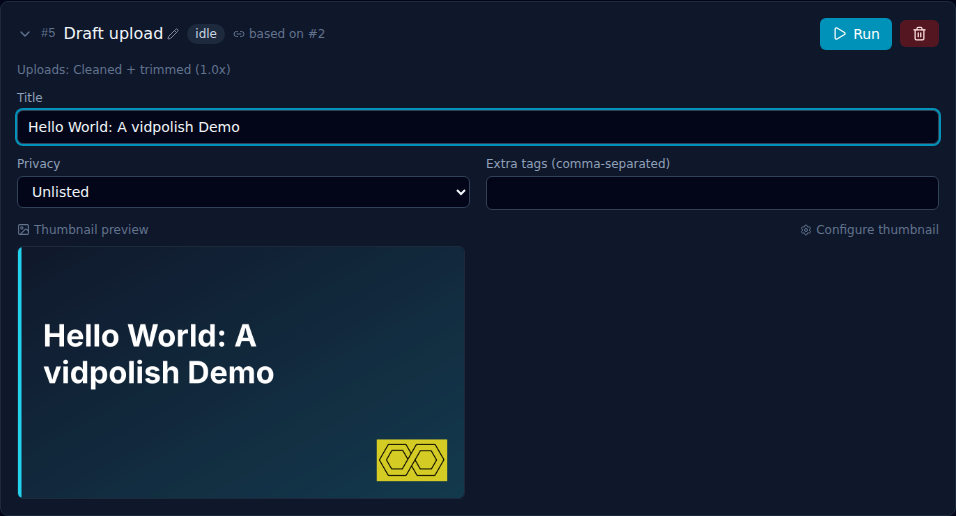

</td><td width="50%">

**A finished upload** — the YouTube link appears as soon as it's known,
in a copyable box (with a dedicated Copy button) rather than a bare link.

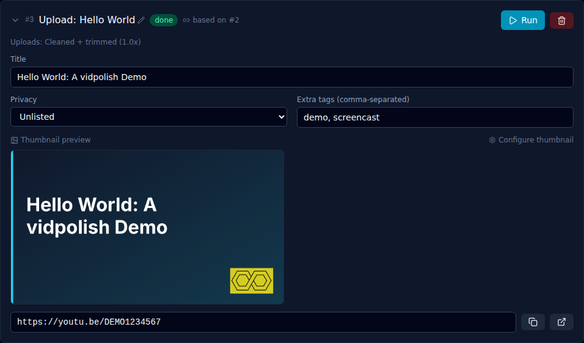

</td></tr>
<tr><td width="50%">

**A finished edit cell** — the resolved video, a compact media-info
summary bottom-right of it, Download, and the new GIF export action, all
next to "Add upload from this edit" as the primary next step.

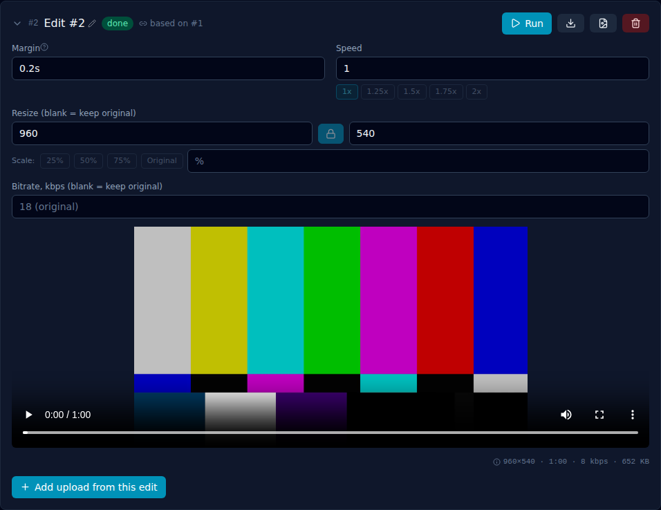

</td><td width="50%">

**Media info, expanded** — click the summary to see full resolution,
duration, bitrate, frame rate and file size, plus a percent-change
comparison against the source.

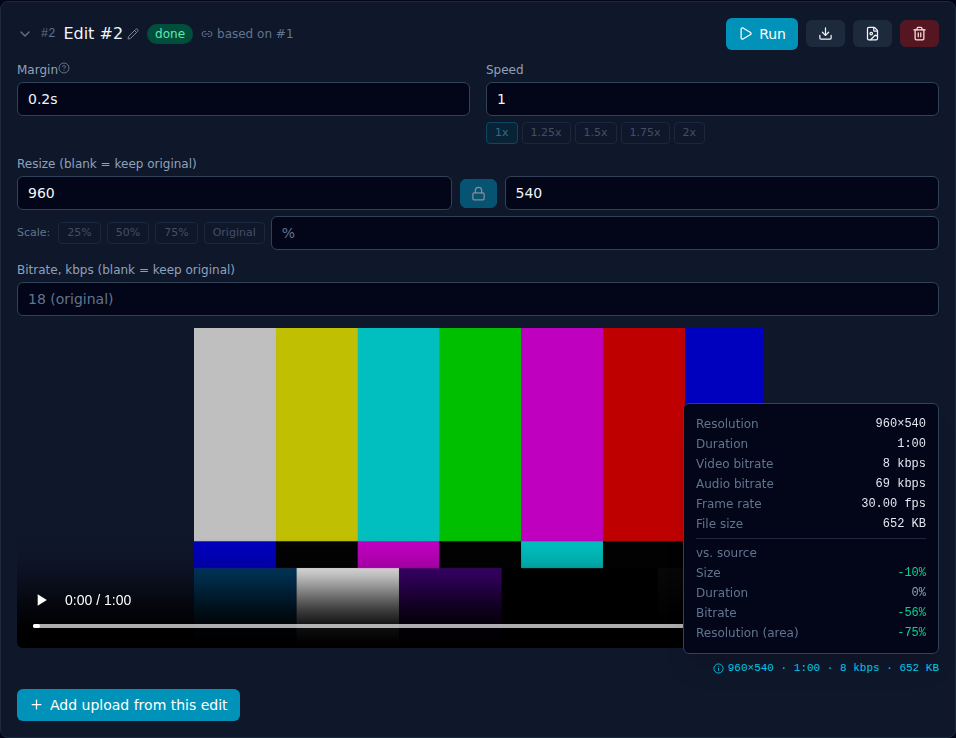

</td></tr>
</table>

**Export as GIF** — pick fps and width, saved through the same
save-file-picker flow as the video download.

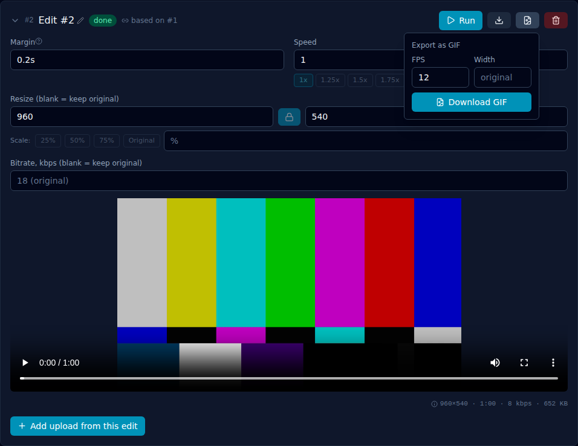

**Config panel** — YouTube credentials (secrets masked), upload defaults,
and thumbnail styling, with automatic backups before every save.

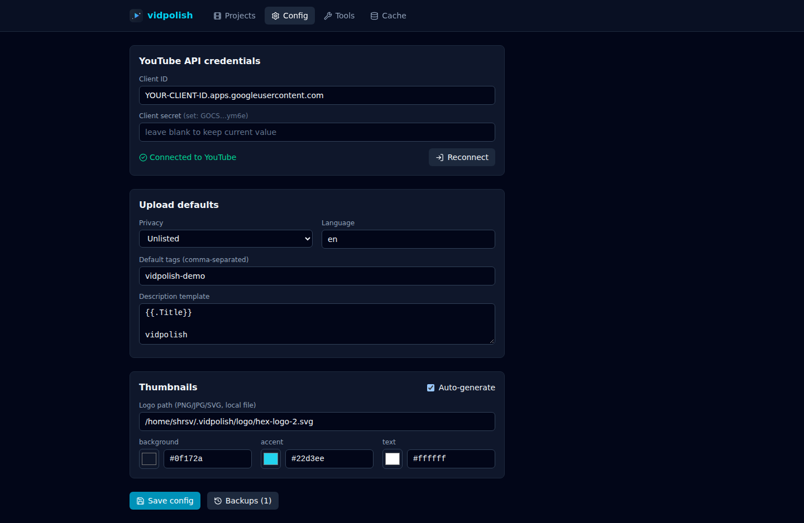

## Prerequisites

You need Go and `ffmpeg` installed before building or running vidpolish.
Everything else (`deep-filter`, `auto-editor`, `resvg`, the Inter font) is
fetched automatically the first time you run the tool, so you do not need
to install those by hand. Node.js is only needed if you're editing the
local UI's frontend (see [Local UI](#local-ui)); the built frontend is
committed to the repo, so a plain `go build` never requires Node.

| Tool | Why it's needed | How to get it |
| --- | --- | --- |
| [Go](https://go.dev/dl/) 1.24+ | builds and runs the CLI | `apt install golang-go`, `brew install go`, or the official installer |
| `ffmpeg` / `ffprobe` | splitting, remuxing, and probing video/audio | `apt install ffmpeg`, `brew install ffmpeg`, or download from [ffmpeg.org](https://ffmpeg.org/download.html) |
| `deep-filter` | audio denoising | downloaded automatically by vidpolish from the [DeepFilterNet releases](https://github.com/Rikorose/DeepFilterNet/releases) into `~/.cache/vidpolish/bin` |
| `auto-editor` | silence cutting and speed changes | downloaded automatically by vidpolish from the [auto-editor releases](https://github.com/WyattBlue/auto-editor/releases) into `~/.cache/vidpolish/bin` |
| `resvg` | rasterizing auto-generated YouTube thumbnails | downloaded automatically by vidpolish from the [resvg releases](https://github.com/linebender/resvg/releases) into `~/.cache/vidpolish/bin` on Linux/macOS; see the platform note below for Windows/linux-arm64 |
| Inter font | text rendering inside generated thumbnails | downloaded automatically by vidpolish from the [Inter releases](https://github.com/rsms/inter/releases) into `~/.cache/vidpolish/fonts` |

Supported platforms for the auto-downloaded `deep-filter`/`auto-editor`
binaries: Linux (x86_64, aarch64), macOS (Intel and Apple Silicon), and
Windows (x86_64).

`resvg` (used only for thumbnail generation) has narrower prebuilt
coverage: Linux x86_64 and macOS (Intel and Apple Silicon) auto-download;
Windows and Linux aarch64 have no official prebuilt binary, so on those
platforms install `resvg` yourself (e.g. `cargo install resvg`, or a
package manager) and make sure it's on PATH. Every other vidpolish feature
works normally regardless; only thumbnail generation is affected.

### Check and install everything in one go

Once Go and ffmpeg are on your machine, let vidpolish resolve the rest:

```sh
git clone git@github.com:shrsv/vidpolish.git
cd vidpolish
go build -o vidpolish ./cmd/vidpolish

./vidpolish deps
```

`vidpolish deps` prints the resolved path for each dependency and downloads
whatever is missing. Run it any time to double check your setup:

```
ffmpeg       /usr/bin/ffmpeg
ffprobe      /usr/bin/ffprobe
deep-filter  /home/you/.cache/vidpolish/bin/deep-filter/0.5.6/deep-filter
auto-editor  /home/you/.cache/vidpolish/bin/auto-editor/31.6.0/auto-editor
resvg        /home/you/.cache/vidpolish/bin/resvg/0.48.1/resvg
font         /home/you/.cache/vidpolish/fonts/inter-4.1/Inter-Regular.ttf, /home/you/.cache/vidpolish/fonts/inter-4.1/Inter-Bold.ttf
```

If `ffmpeg`/`ffprobe` are missing, `deps` tells you to install them; it will
not attempt to fetch those itself since they are near-universally available
through a system package manager.

## Usage

The basic case, denoise and trim silence with default settings:

```sh
./vidpolish process path/to/recording.mp4
# -> output/recording-polished.mp4
```

Give the kept speech more breathing room if cuts feel too tight (default is
`0.2s`):

```sh
./vidpolish process --margin 0.3s path/to/recording.mp4
```

Speed up the parts you kept, say to tighten a long walkthrough (silence is
still fully cut, not just sped through):

```sh
./vidpolish process --speed 1.25 path/to/recording.mp4
./vidpolish process --speed 1.5  path/to/recording.mp4
./vidpolish process --speed 1.75 path/to/recording.mp4
```

Send the result somewhere other than `./output`:

```sh
./vidpolish process --output-dir ~/Desktop/clips path/to/recording.mp4
```

Force a full recompute even if a cached run already exists for this file:

```sh
./vidpolish process --no-cache path/to/recording.mp4
```

Flags can go before or after the input path; both of these work the same
way:

```sh
./vidpolish process --speed 1.5 path/to/recording.mp4
./vidpolish process path/to/recording.mp4 --speed 1.5
```

### All `process` flags

| Flag | Default | Description |
| --- | --- | --- |
| `--margin` | `0.2s` | Padding kept around detected speech before a cut. Raise it (e.g. `0.3s`) if words feel clipped. |
| `--speed` | `1.0` | Speed multiplier for kept/spoken segments only, between `0.5` and `4.0`. Silence stays fully cut. |
| `--width` | original | Resize output to this width in pixels. Pair with `--height`, or leave it out to scale proportionally. |
| `--height` | original | Resize output to this height in pixels. Pair with `--width`, or leave it out to scale proportionally. |
| `--bitrate` | original | Target video bitrate in kbps. Leaving it unset keeps the original encode quality (no bitrate-driven re-encode). |
| `--output-dir` | `output` | Directory the final file is written to. |
| `--no-cache` | off | Ignore cached intermediate artifacts and recompute everything. |

Leaving `--width`/`--height`/`--bitrate` unset skips the resize/re-encode pass
entirely — the auto-edited output is used verbatim, at its original
resolution and bitrate.

### Cache commands

```sh
./vidpolish cache clean   # remove all cached pipeline artifacts right now
```

## How caching works

The expensive parts of the pipeline (splitting, denoising, remuxing) do not
depend on `--margin` or `--speed`, only on the source file. vidpolish caches
those intermediate artifacts at `~/.vidpolish/cache/<fingerprint>/`, keyed
by a fast content fingerprint of the input (its size, modification time,
and sampled head/tail bytes, not a full-file hash). Re-running `process` on
the same file with a different `--speed` or `--margin` reuses that cached
work and only re-runs the fast final cut, instead of redoing several
minutes of denoising.

Cache entries are kept for 7 days and swept lazily on each run, or you can
purge them immediately with `vidpolish cache clean`. This is a separate
cache from `~/.cache/vidpolish/bin`, which only holds the downloaded tool
binaries themselves.

**Your source file is never modified.** Every stage reads the input and
writes to a separate cache/output path; nothing in the pipeline writes back
to the file you pass to `process`.

## YouTube upload

vidpolish can upload the polished result straight to YouTube, defaulting
to an unlisted video with progress and an ETA printed while it uploads.

### One-time setup in Google Cloud Console

Uploading is a write operation on your channel, so it needs OAuth 2.0
consent, not just an API key:

1. Create (or pick) a project at [console.cloud.google.com](https://console.cloud.google.com/),
   then enable the **YouTube Data API v3** under APIs & Services.
2. Under APIs & Services > Credentials, create an **OAuth client ID** of
   type **Desktop app**. Note the client ID and client secret.
3. If your project's OAuth consent screen is still in testing mode, add
   your own Google account as a test user so login doesn't get rejected.

### Configure and log in

```sh
./vidpolish config init
```

Creates `~/.vidpolish/config.toml`. Open it and fill in `client_id` and
`client_secret` from step 2 above, and adjust `privacy`/`default_language`
if you want different defaults. Then:

```sh
./vidpolish youtube login
```

Opens a browser for a one-time consent screen and stores a refresh token
back into the config file. You do not need to repeat this on future
uploads, only if you revoke access or move to a new machine.

If your Google Cloud project's OAuth consent screen is in testing mode,
add your own account under Test users first or the consent step will be
rejected.

On a headless machine or inside WSL, `vidpolish youtube login` cannot open
a browser for you; it prints the authorization URL instead so you can open
it yourself (on Windows, if you're in WSL). It listens on a local port for
up to 5 minutes waiting for you to approve it.

### Uploading

```sh
./vidpolish upload path/to/polished.mp4
./vidpolish upload path/to/polished.mp4 --title "Walkthrough" --privacy public --language en-IN
```

Or do the whole thing in one command, polish then upload:

```sh
./vidpolish process path/to/recording.mp4 --upload --speed 1.25 --privacy unlisted
```

Every upload prints progress and an ETA as it goes, then the video link
**as soon as it's known**, right after the upload itself finishes:

```
==> uploading path/to/polished.mp4 as unlisted
uploading: 100% (ETA ...)
uploaded: https://youtu.be/dQw4w9WgXcQ
==> processing status: processing
==> done, video is fully processed: https://youtu.be/dQw4w9WgXcQ
```

The link is valid and shareable the moment it prints; you do not need to
wait for the "fully processed" line. That part only continues to poll
YouTube (for up to about two minutes) so you can see when it finishes
transcoding. Skip that wait entirely with `--no-wait`, and the command
returns right after the `uploaded:` line.

By default the description and tags contain just `vidpolish`; see the
next section for setting your own defaults. Fill in anything else you
want from YouTube Studio afterward.

### `upload` / `process --upload` flags

| Flag | Default | Description |
| --- | --- | --- |
| `--title` | input filename | Video title. |
| `--privacy` | from config (`unlisted`) | `public`, `unlisted`, or `private`. |
| `--language` | from config (`en`) | BCP-47 language code, e.g. `en`, `en-IN`. |
| `--no-wait` | off | Return right after the upload finishes instead of also waiting on YouTube's processing status. |
| `--thumbnail <path>` | none | Use a specific pre-made image as the thumbnail instead of auto-generating one. |
| `--no-thumbnail` | off | Don't set a thumbnail for this upload; generation is on by default otherwise. |

### Default tags and description

Two `[youtube]` fields in `~/.vidpolish/config.toml` control what goes on
every upload beyond the title:

```toml
default_tags        = ["golang", "screencast"]
description_template = "{{.Title}}\n\nvidpolish"
```

`default_tags` is merged with a fixed `vidpolish` tag (which is always
included) on every upload. `description_template` is rendered with Go's
`text/template`, given `{{.Title}}` as the resolved video title; if the
rendered result doesn't contain the word `vidpolish`, it's appended
automatically so that tag is always present even if you edit the template.

### Auto-generated thumbnails

**Enabled by default.** Every `upload`/`process --upload` generates a
1280x720 thumbnail and sets it on the video automatically: a brand
background, your logo in a corner (if you configure one), and the video
title laid out with a title-fitting pass that shrinks the font and wraps
across up to three lines for longer titles, truncating with an ellipsis
only as a last resort. You don't need to turn anything on for this; it
just happens as part of `upload`. It's built as an SVG (so it stays
human-inspectable/tweakable) and rasterized with
[resvg](https://github.com/linebender/resvg).

Skip it for a single run with `--no-thumbnail`, or use your own
pre-made image with `--thumbnail <path>` instead of generating one.
To turn it off entirely, set `enabled = false` under `[thumbnail]` in
`~/.vidpolish/config.toml`; leaving `[thumbnail]` out of the config
entirely (or `vidpolish config init`'s freshly generated file) means it
stays on, since on is the default either way.

Configure it under `[thumbnail]` in `~/.vidpolish/config.toml`:

```toml
[thumbnail]
enabled           = true   # generation is on by default even without this line
logo_path         = "/path/to/your/logo.svg"   # PNG/JPG also accepted; empty = no logo
background_color  = "#0f172a"
accent_color      = "#22d3ee"
text_color        = "#ffffff"
```

`logo_path` is entirely up to you; an SVG logo is rasterized automatically
(and cached) the first time it's used. The generated PNG is saved next to
the uploaded video as `<name>-thumbnail.png`, along with its source `.svg`,
so you can see exactly what got set and hand-edit the SVG if you want.

**Custom thumbnails require phone verification on your channel.** This is
a real YouTube API requirement, not a vidpolish limitation: if your
channel hasn't verified a phone number, `thumbnails.set` will fail and
vidpolish surfaces YouTube's own error text (which names the requirement
directly) rather than failing silently. Verify your channel from YouTube
Studio if you hit this. The video itself still uploads fine either way;
only the custom thumbnail step is affected.

See the Prerequisites table above for resvg's platform coverage and the
manual-install fallback on Windows/linux-arm64.

YouTube's own AI/suggested-thumbnail feature (in Studio) isn't reachable
through the public Data API, so vidpolish can't tap into it directly;
this generated-thumbnail approach is the alternative.

### About automatic captions

There is no API call that generates subtitles on demand. YouTube's
automatic captions are produced by YouTube's own backend once it finishes
processing the audio track. What vidpolish does control is
`defaultLanguage`/`defaultAudioLanguage` on the uploaded video (via
`--language` or the config default), which tells YouTube which language
model to use for auto-generated captions. Setting it correctly improves
caption accuracy and availability, but does not force captions to appear
on any particular schedule.

## Local UI

```sh
./vidpolish ui
```

Starts a small local web app, embedded in the `vidpolish` binary itself
(no separate server or process to run), and opens it in your browser at
`http://127.0.0.1:7890` (`--port` to change it, `--no-open` to skip
launching a browser). It binds to `127.0.0.1` only and has no login page
of its own — the same local-machine trust model as running the CLI.

### The "Projects" model

The UI is organized around **Projects**, notebook-style. Each project is
an ordered list of **cells**:

- **Source cell** (`#1`, always first): drag a video in, or use the file
  picker. Created automatically with the project.
- **Edit cells**: denoise + cut at a chosen margin (with an inline
  explanation of what it does) and speed (1x/1.25x/1.5x/1.75x/2x presets,
  or type your own), with optional resize — exact pixels, or a quick
  25/50/75%/original scale, aspect-locked by default — and bitrate
  overrides; left blank, everything stays at the source's original
  values, and a rough size estimate updates live as you change them. Each
  is its own named, independently runnable cell (e.g. "1.25x draft", "slow
  calm cut"). Add as many as you want at different speeds; they share the
  same underlying denoise/split work via the same cache `process` uses,
  so trying five speeds doesn't denoise five times, and running several
  at once is safe (the shared stage is serialized per-source internally,
  the fast parts run in parallel). Once a cell has run, a compact
  resolution/duration/bitrate/size summary sits under the video (click for
  the full breakdown plus a vs.-source comparison), and you can Download
  the result or export it as a GIF (fps/width configurable) alongside it.
- **Upload cells**: pick which edit cell's output to push to YouTube,
  set title/description/tags/privacy per cell, and run it. Multiple
  upload cells can target the same or different edit cells and run
  concurrently.

Every cell has a stable number (`#2`, `#3`, ...) assigned once and never
reused, even if you reorder or delete other cells, plus an optional
custom name you can set any time — both work as a way to refer back to
that cell. Running cells stream live progress (the same stage/status
lines the CLI prints) over the page in real time, and edit-cell/upload
results (a video player, a clickable YouTube link) appear as soon as
they're ready — link included, same as the CLI, before YouTube finishes
processing.

### Config, tools, and cache panels

The **Config** tab manages `~/.vidpolish/config.toml` from the browser:
YouTube credentials (client secret and refresh token are never sent back
to the browser in full, only a short preview, so the page is safe to
leave open), upload defaults, and thumbnail settings, plus a "Connect
YouTube" button that runs the same OAuth flow as `vidpolish youtube
login`. The **Tools** tab shows the same resolution status as `vidpolish
deps` with a re-check button per tool. The **Cache** tab lists
`~/.vidpolish/cache` entries with size/age and lets you delete one or
clean all expired entries, equivalent to `vidpolish cache clean`.

### Developing the UI itself

The frontend lives in `web/` (Preact + Vite + Tailwind) and builds into
`internal/server/webdist/`, which is committed to the repo and embedded
via `go:embed`. Building the `vidpolish` binary never requires Node —
only editing the UI does:

```sh
cd web
npm install
npm run dev     # Vite dev server with hot reload, proxies /api to :7890
npm run build   # writes internal/server/webdist for `go build` to embed
```

## Project layout

```
cmd/vidpolish         CLI entrypoint (flag parsing, wiring)
internal/binmgr        resolves/downloads deep-filter, auto-editor, resvg, and the Inter font
internal/browseropen   opens a URL in the default browser
internal/cache         the ~/.vidpolish/cache artifact cache
internal/config        ~/.vidpolish/config.toml load/init/save
internal/pipeline      the split / denoise / remux / auto-edit stages
internal/server        the embedded local UI's HTTP API and static frontend
internal/store         SQLite-backed Projects/Cells storage (~/.vidpolish/vidpolish.db)
internal/thumbnail     SVG-based thumbnail generation, rasterized via resvg
internal/ytauth        YouTube OAuth 2.0 installed-app login flow
internal/ytmeta        shared tag/description building for uploads
internal/ytupload      resumable YouTube upload with progress/ETA and thumbnail set
media/                 logo assets
web/                   Preact/Vite source for the local UI
```

## Status and roadmap

vidpolish covers the local processing pipeline (split, denoise, cut,
optional speed changes, with caching), uploading the result to YouTube
as unlisted-by-default with progress, ETA, language metadata, default
tags/description, and an auto-generated thumbnail, and a local
"Projects" UI (`vidpolish ui`) built on top of the same library, with
config/tools/cache management panels.

## Development

```sh
go build ./...
go vet ./...
go test ./...
```

## License

MIT. See [LICENSE](LICENSE).
